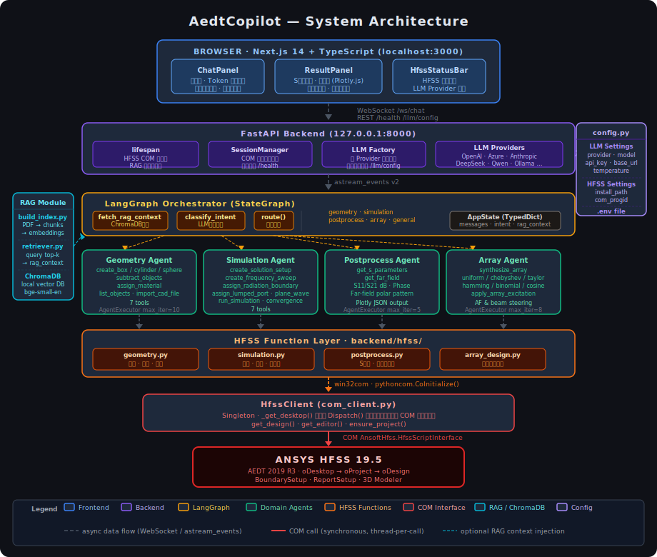

# AedtCopilot

**An AI-powered Copilot for ANSYS HFSS — control your EM simulation through natural language.**

AedtCopilot connects a large language model to HFSS via the Windows COM interface, letting engineers describe what they want in plain text and have it executed automatically: create geometry, configure excitations and boundaries, run simulations, and visualize results — all without writing a single script.



---

## ✨ Features

| Category | Capability |
|----------|-----------|
| **Geometry** | Create boxes, cylinders, spheres; Boolean subtract; assign materials; import CAD files |
| **Simulation** | Solution setup, frequency sweep, radiation boundary, lumped port, plane-wave excitation, run & monitor convergence |
| **Post-processing** | Extract S-parameters, plot far-field patterns, export data |
| **Array Design** | Antenna array synthesis (uniform / Chebyshev / Taylor / Hamming), beam steering, write excitations back to HFSS |
| **RAG Knowledge** | Retrieve relevant snippets from HFSS scripting guides automatically to improve accuracy |
| **Multi-LLM** | Switch between OpenAI, Azure OpenAI, Anthropic Claude, and any OpenAI-compatible API at runtime |
| **Streaming UI** | Real-time token streaming, tool-call indicators, S-parameter charts, far-field polar plots |

---

## 🏗️ Architecture

```
Browser (Next.js)
    │  WebSocket /ws/chat
    ▼
FastAPI Backend (port 8000)
    │  LangGraph astream_events
    ▼
Orchestrator Agent  ──intent classification──►  geometry / simulation
    │                                            postprocess / array
    │  LangChain Tool-Calling AgentExecutor
    ▼
HFSS Function Layer  ──win32com──►  ANSYS HFSS (running locally)
```

**Key components:**

- `backend/` — FastAPI app, HFSS COM client, RAG retriever, LLM factory
- `agents/` — LangGraph orchestrator + 4 domain agents + tool wrappers
- `frontend/` — Next.js 14 chat UI with Plotly charts

---

## 🔧 Requirements

| Dependency | Version |
|-----------|---------|
| **OS** | Windows 10 / 11 (COM interface required) |
| **ANSYS HFSS** | 19.5 (2019 R3) or compatible |
| **Python** | 3.11+ |
| **Node.js** | 18+ |
| **LLM API** | Any supported provider (see [Configuration](#configuration)) |

> HFSS must be **running and have an active project open** before starting the backend.

---

## 🚀 Installation

### 1. Clone the repository

```bash
git clone https://github.com/<your-org>/AedtCopilot.git
cd AedtCopilot
```

### 2. Set up Python environment

```powershell
python -m venv .venv
.\.venv\Scripts\Activate.ps1
pip install -r requirements.txt
```

> On slow networks, use a mirror:
> ```powershell
> pip install -r requirements.txt -i https://mirrors.aliyun.com/pypi/simple/ --trusted-host mirrors.aliyun.com
> ```

### 3. Set up frontend

```powershell
cd frontend
npm install
cd ..
```

### 4. Configure environment variables

```powershell
copy .env.example .env
```

Edit `.env` with your settings (see [Configuration](#configuration) below).

### 5. (Optional) Build the RAG knowledge index

Index the HFSS scripting guide PDF for on-the-fly document retrieval:

```powershell
$env:PYTHONPATH = "."
.\.venv\Scripts\python.exe -m backend.rag.build_index `
    --pdfs "C:\path\to\HFSSScriptingGuide.pdf" `
           "C:\path\to\HFSS.pdf"
```

The index is stored in `./data/chromadb/`. The system runs without it (graceful degradation to pure-LLM mode).

---

## ▶️ Running

**Step 1 — Open HFSS** and ensure an active project is loaded.

**Step 2 — Start the backend:**

```powershell
$env:PYTHONPATH = "D:\path\to\AedtCopilot"
.\.venv\Scripts\python.exe -m uvicorn backend.main:app --host 127.0.0.1 --port 8000
```

**Step 3 — Start the frontend:**

```powershell
cd frontend
npm run dev
```

**Step 4 — Open your browser at [http://localhost:3000](http://localhost:3000)**

Verify the backend is healthy:
```
GET http://127.0.0.1:8000/health
```
Expected response includes `"hfss_connected": true`.

---

## ⚙️ Configuration

All settings are controlled via the `.env` file (or environment variables). Copy `.env.example` to `.env` and fill in your values.

### LLM Provider

AedtCopilot supports four provider types. Set `LLM_PROVIDER` to one of:

#### OpenAI
```ini
LLM_PROVIDER=openai
LLM_API_KEY=sk-xxxxxxxxxxxxxxxx
LLM_MODEL=gpt-4o
```

#### Azure OpenAI
```ini
LLM_PROVIDER=azure_openai
LLM_API_KEY=xxxxxxxxxxxxxxxx
LLM_MODEL=gpt-4o
AZURE_ENDPOINT=https://<resource>.openai.azure.com
AZURE_DEPLOYMENT=gpt-4o
AZURE_API_VERSION=2024-02-01
```

#### Anthropic Claude
```ini
LLM_PROVIDER=anthropic
LLM_API_KEY=sk-ant-xxxxxxxx
LLM_MODEL=claude-3-5-sonnet-20241022
```

#### Any OpenAI-Compatible API (DeepSeek, Qwen, Kimi, Ollama, etc.)
```ini
LLM_PROVIDER=openai_compatible
LLM_API_KEY=sk-xxxxxxxxxxxxxxxx
LLM_MODEL=deepseek-chat
LLM_BASE_URL=https://api.deepseek.com/v1
```

### HFSS Path
```ini
HFSS_INSTALL_PATH=D:\Program Files\AnsysEM\AnsysEM19.5\Win64
HFSS_COM_PROGID=AnsoftHfss.HfssScriptInterface
HFSS_PROJECT_DIR=D:\Projects\HFSS
```

### RAG / Embedding
```ini
# Use local model (no API key needed):
EMBEDDING_PROVIDER=local
EMBEDDING_MODEL=BAAI/bge-small-en-v1.5

# Or use OpenAI embeddings:
# EMBEDDING_PROVIDER=openai
# EMBEDDING_MODEL=text-embedding-3-small
```

> You can also switch LLM provider at runtime **without restarting the backend** via `POST /llm/config`.

---

## 💬 Usage Examples

Type natural language commands in the chat panel:

| Intent | Example command |
|--------|----------------|
| Create geometry | `创建一个长10mm宽5mm高2mm的矩形贴片，材料为PEC` |
| Set boundary | `给Air_Region设置辐射边界条件` |
| Add port | `在Feed_Rect上创建集总端口，阻抗50欧姆` |
| Plane wave | `设置平面波激励，频率300MHz，入射角theta=45°，phi=0°` |
| Run simulation | `创建仿真设置，频率2.4GHz，运行仿真` |
| View results | `查看S11参数，频率范围1-4GHz` |
| Array design | `设计8元线阵，间距0.5λ，旁瓣≤-30dB，主瓣指向30°` |

---

## 🧪 Testing

```powershell
$env:PYTHONPATH = "D:\path\to\AedtCopilot"

# Unit tests (no HFSS required — COM is mocked)
.\.venv\Scripts\python.exe -m pytest tests/test_hfss tests/test_agents -q

# Integration tests (HFSS + backend must be running)
.\.venv\Scripts\python.exe -m pytest tests/test_integration/ --integration -v
```

---

## 📁 Project Structure

```
AedtCopilot/
├── backend/
│   ├── main.py              # FastAPI entry point
│   ├── config.py            # Settings (pydantic-settings + .env)
│   ├── llm_factory.py       # Multi-provider LLM factory
│   ├── hfss/
│   │   ├── com_client.py    # HFSS COM singleton (thread-safe)
│   │   ├── geometry.py      # Geometry operations
│   │   ├── simulation.py    # Excitations, boundaries, solver
│   │   └── postprocess.py   # Result extraction
│   ├── prompts/
│   │   └── system_prompts.py  # Agent system prompts
│   └── rag/
│       ├── build_index.py   # Offline index builder (PDF → ChromaDB)
│       └── retriever.py     # Online retriever
├── agents/
│   ├── orchestrator.py      # LangGraph intent router
│   ├── geometry_agent.py
│   ├── simulation_agent.py
│   ├── postprocess_agent.py
│   ├── array_agent.py
│   └── tools/               # @tool wrappers for each domain
├── frontend/
│   └── src/
│       ├── components/      # ChatPanel, ResultPanel, HfssStatusBar
│       └── hooks/useChat.ts # WebSocket state management
├── tests/
├── scripts/
│   ├── validate_hfss.py     # Manual HFSS validation script
│   └── e2e_ui_test.py       # End-to-end UI test
├── .env.example
├── requirements.txt
└── CAE_COPILOT_DEV.md       # Developer guide (architecture & lessons learned)
```

---

## 🔌 Extending to Other CAE Software

The multi-agent architecture is not HFSS-specific. To adapt to another simulator:

1. Replace `backend/hfss/` with a new API client for your target software
2. Reuse the agent/tool/prompt structure unchanged
3. Update system prompts to describe the new tool set

See [CAE_COPILOT_DEV.md](CAE_COPILOT_DEV.md) for a detailed guide on adapting to COMSOL, CST, OpenFOAM, Abaqus, and others.

---

## 📋 Roadmap

- [ ] Support AEDT 2020+ (unified API for newer versions)
- [ ] Multi-project / multi-design session management
- [ ] Parametric sweep via natural language
- [ ] Optimizer integration (HFSS Optimetrics)
- [ ] Batch simulation queue
- [ ] Docker deployment (backend only; frontend is already portable)

---

## 🤝 Contributing

Contributions are welcome! Please open an issue or pull request.

When adding a new tool, follow the four-layer checklist in [CAE_COPILOT_DEV.md § New Tool Checklist](CAE_COPILOT_DEV.md#新增工具-checklist).

---

## 📄 License

MIT License — see [LICENSE](LICENSE) for details.

---

## Acknowledgements

- [LangChain](https://github.com/langchain-ai/langchain) & [LangGraph](https://github.com/langchain-ai/langgraph)
- [ANSYS Electronics Desktop](https://www.ansys.com/products/electronics/ansys-hfss)
- [shadcn/ui](https://ui.shadcn.com/) & [Plotly.js](https://plotly.com/javascript/)
